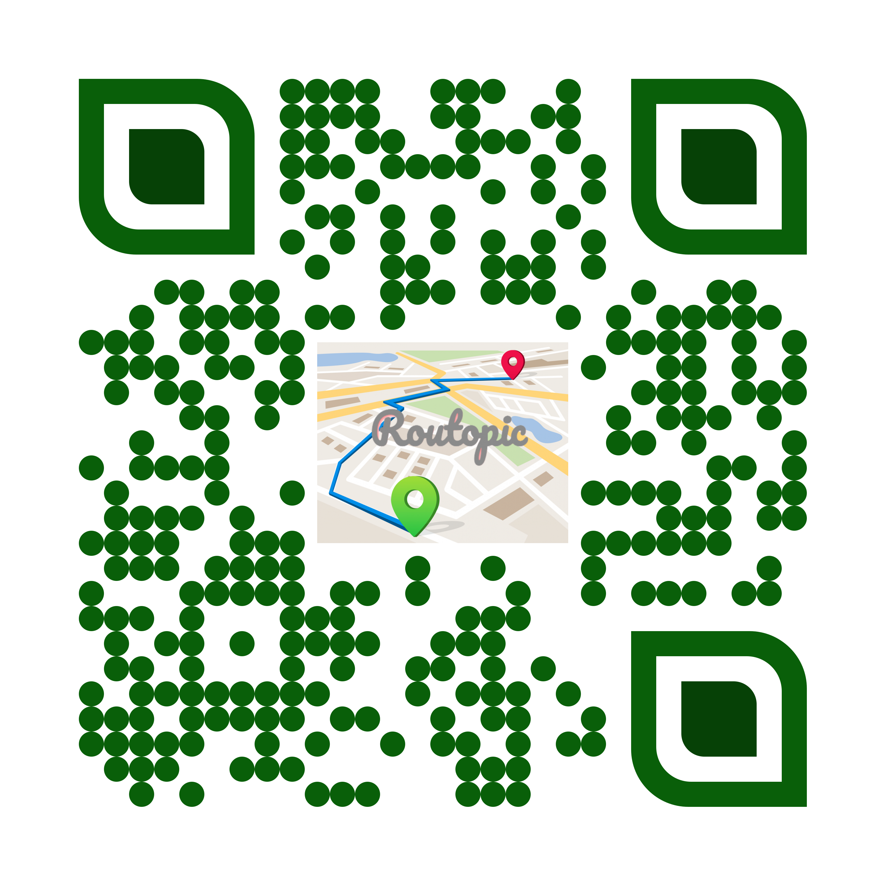
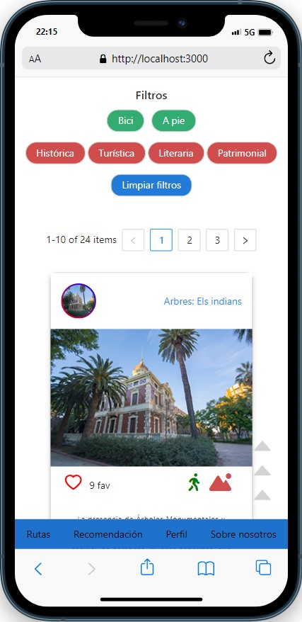

#  <center> Proyecto Full Stack MERN: Rutopic </center> 


 ## :clipboard: Índice :clipboard:

 - [Sobre el proyecto](#bookmarktabs-sobre-el-proyecto-bookmarktabs)

    - [Instalación y despliegue](#nutandbolt-instalación-y-despliegue)

    - [Tecnologías utilizadas](#wrench-tecnologiaspackages-utilizados)

    - [Origen](#dart-origen)

    - [Objetivos](#pushpin-objetivos)

    - [Inspiración](#cinema-inspiración)

- [Descripción del proyecto](#greenbook-descripción-del-proyecto-greenbook)

    - [API](#1-api)


- [Retos presentados](#dart-retos-presentados-dart)


- [Agradecimientos](#agradecimientos)

- [Futuras implementaciones](#blacknib-futuras-implementaciones-blacknib)

- [Autores](#raisedhands-autor-raisedhands)

------------------

# :bookmark_tabs: Sobre el proyecto :bookmark_tabs:


## :nut_and_bolt: Instalación y despliegue 

El proyecto se subirá a un repositorio público de GitHub.
Además, el backend procede de la API que hemos creado en MongoDB: [App Rutopic API](https://github.com/Molerog/Backend-tripulaciones).

Para instalar este proyecto debes hacer lo siguiente: primero acceder desde github a los dos repositorios y proceder a clonártelos con el siguiente comando:
````
git clone https://github.com/vaneebg/FRONTEND-TRIPULACIONES
git clone https://github.com/Molerog/Backend-tripulaciones
````
Una vez clonado el repositorio es muy importante que en tu consola instales todos los npm que necesita cada proyecto con el siguiente comando: 
````
npm i
````


Por último, en caso de querer correr en local, procede a levantar el servidor primero en el proyecto de backend con este comando:
```
npm start
```
Y después en el proyecto de frontend, entras con cd redux-frontend-tripulaciones/ y una vez dentro de la carpeta, levantas el servidor:
```
npm start
```

Automáticamente se te abrirá una nueva ventana del navegador con la página web.

Ambos repositorios están desplegados, el backend en Heroku y el frontend en Amazon Web Service. En caso de querer acceder al proyecto desplegado, la página web es la siguiente: https://main.d3kb3i2flsi28n.amplifyapp.com/

También se puede acceder a ella mediante el escaneo de este código QR:



---------
## :wrench: Tecnologías/packages utilizados 
- Javascript
- React
- SASS
- Redux
- React Router
- React-leaflet
- Axios
- NodeJS
- MongoDB
- Mongoose
- Bcrypt
- Jsonwebtoken
- Multer
- AntDesign
- Font awesome
- Cypress
- Cypress-file-upload
- Cypress-localstorage-commands
- Dotenv
- Trello


------

## :dart: Origen 

EL origen del proyecto es la creación de un MVP Webb de una Aplicación de Rutas para el área metropolitana de Valencia

Para ello se procedido a validar una necesidad a cubrir que hemos detectado en el mercado, con un Plan de Acción claro: La creación de una web intuitiva, cercana

----

## :pushpin: Objetivos 

Objetivos de marketing:
* Detección de la necesidad
* Aglutinar en una App las rutas más emblemáticas de Valencia
* Plan de acción: crear una web responsive, intuitiva, amigable y escalable
* Ámbito de actuación global: al ser una web destinada al turismo queremos que tenga la máxima repercusión y alcance
* Fácilmente escalable: 
<br>
    - 1. Traducir la web en varios idiomas(valenciano,inglés,francés,italiano,etc)
    - 2. Que el usuario pueda crear sus propias rutas
    - 3. Añadir ciudades de otras poblaciones

<br>
Tras la validación de la idea y del público objetivo se procederá a la creación del MVP para consolidar la idea inicial

<br>

Objetivos a nivel funcional:
* Aplicación privada
* Registro de usuarios
* Login de usuarios
* Vista Rutas
* Detalle de las rutas: puntos de interés, comentarios sobre las rutas y puntuación de rutas
* Guardar ruta en favoritos
* Vosta perfil(datos personales y rutas favoritas)
* Vista cuestionario
* Logout de usuarios


-----


## :cinema: Inspiración 

Para la creación de la App nos hemos basado en otros modelos de redes sociales tales como: Facebook, Instagram, Tweeter, etc


----------

----------

# :framed_picture:  Imagen de ejemplo




## 1. API

Documentación en Swagger:
````
http://localhost:8080/api-docs/
````


--------
# :dart: Retos presentados :dart:

Crear un ranking de rutas más valoradas
La creación de la App en varios componentes
Efectuar un correcto deployment


--------
# :purple_heart: Agradecimientos :purple_heart:

Agradecimientos a mis compañeros de equipo por el trabajo tan intenso a la par que gratificante teniendo en cuenta que hemos desarrollado una aplicación completamente funcional en 9 días.

-----------
# :raised_hands: Autores :raised_hands:

- [Germán Molero](https://github.com/Molerog)
- [Vanesa Beltrán](https://github.com/vaneebg)
- [Vicente Barberá](https://github.com/Vincecoorp21)
- [Rebeca Alonso](https://github.com/RebecaASuesta)